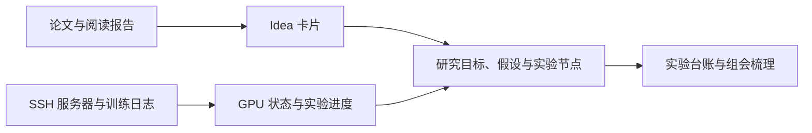

# DSH 科研插件集

为 [DeepSeek Harness（DSH）](https://www.npmjs.com/package/@deepseek-ai/dsh) 提供论文阅读、服务器监控和研究过程管理。三个插件可独立安装，也可以配合使用：保存论文与阅读证据，把想法整理成实验节点，再关联服务器上的训练进度。

| 插件 | 适合解决的问题 | npm 包 |
|---|---|---|
| [📚 学者工作台](./dsh-scholar/README.md) | 论文存在哪里、讲了什么、哪些想法值得验证 | `dsh-scholar-desk` |
| [🖥️ 服务器看板](./dsh-server-dashboard/README.md) | 哪台机器在运行什么、训练是否停滞、GPU 是否异常 | `dsh-server-dashboard` |
| [🧭 研究主线图](./dsh-trajectory/README.md) | 当前研究目标是什么、证据如何积累、下一步推进哪个节点 | `dsh-trajectory` |

本仓库采用单仓库、多 npm 包结构。每个插件有独立的构建入口、配置和 MIT 许可证。

## 三个插件如何配合



关联由用户或对话中的工具操作建立。主线图可以打开关联论文和卡片，也可以匹配已绑定实验的服务器进度；插件不会仅凭一个想法自动启动远端训练。

## 📚 学者工作台

从文献收藏到阅读报告、交互式追问和 Idea 沉淀，集中放在 DSH 侧栏中。

- **论文库**：arXiv / DOI 元数据补全、去重、PDF 附件、阅读状态、星级、分区、保存的筛选和最近浏览。分区栏默认在左侧，可手动收起；长列表独立滚动。
- **精读与追问**：内置论文阅读管线，支持论文精读、轻量综合和速读；报告整理结论、证据、实验、局限与出处。完成阅读后，可基于保存的章节片段追问。
- **多篇对比**：批量阅读或利用已归档结果，对比方法、证据和适用条件。
- **Idea 书柜**：分组、看板、表格、网格、列表五种视图，记录来源、创新点、证据和验证状态，支持卡片关联、Markdown 导出与回顾。
- **知识图谱**：论文、概念和 Idea 节点；支持标签同步、模型辅助抽取、引用同步以及搜索、聚焦和关系过滤。
- **引用与对话**：GB/T 7714、APA、BibTeX 格式，13 个对话工具；内容交付保留宿主输入框的已有草稿和附件。

[阅读学者工作台完整介绍 →](./dsh-scholar/README.md)

## 🖥️ 服务器看板

通过 SSH 集中观察多台 Linux 服务器，适合同时维护多个 GPU 实验。

- **资源总览**：GPU 利用率、显存、温度、功耗、占用进程，以及 CPU、内存、磁盘和负载；GPU 热力图定位到具体主机和显卡。
- **训练日志**：手动指定或自动发现日志，展示尾部内容与曲线，解析常见键值、epoch、tqdm、YOLO 表格和 JSON 行格式。
- **图表与整理**：曲线平滑、多卡叠图、放大查看、CSV 导出；主机可固定或收起，异常状态集中展示。
- **告警与恢复**：主机失联、高温、日志停滞、进程消失等提示；失败采用退避重试，也可立即重试。
- **连接管理**：密钥、密码和 SSH 配置导入，校验已记录的主机指纹，通过宿主管理凭据。配置冲突保留草稿并要求重新核对。

远端操作以读取系统状态、进程和日志为目的。日志停滞或进程消失是需要检查的信号，并不等于已经确认训练失败。

[阅读服务器看板完整介绍 →](./dsh-server-dashboard/README.md)

## 🧭 研究主线图

把研究目标、假设、实验、阅读与写作放进同一份项目记录，按 DSH 工作区定位。

- **目标与假设**：记录研究问题、目标演变和假设状态，保留过程信息。
- **清单与 DAG**：清单展示主线、分支和实验台账；有向图表达推进、输入和组成关系，写入时拒绝新建环路。
- **实验台账**：记录做了什么、关键数据、结构化指标、结论和日期，支持回看及组会整理。
- **跨插件关联**：按名称查找论文、Idea 和服务器，保留稳定 ID；服务器预览使用缓存，进度匹配有歧义时不会任意选择 GPU。
- **编辑保护**：关联字段计入未保存草稿；节点与主线调整一次写入，避免只保存一半。
- **对话维护**：14 个工具覆盖项目、目标、假设、节点、实验条目与关系；当前工作区的进展摘要可进入宿主对话上下文。

[阅读研究主线图完整介绍 →](./dsh-trajectory/README.md)

## 安装与更新

需要 DSH Web 环境和 Node.js。插件声明的 DSH 依赖基线为 `0.1.5-rc.2`；本轮验证环境为 Windows、Node.js 24 和 Chrome，其他平台需结合宿主环境验证。

### npm 已发布版本

```sh
dsh plugin --profile web add dsh-scholar-desk
dsh plugin --profile web add dsh-server-dashboard
dsh plugin --profile web add dsh-trajectory
```

按需安装一个或多个。安装或升级后，完整重启 DSH 宿主并重新加载页面。

**GitHub Release v0.3.0 已包含三个插件的预构建包与 SHA-256 校验文件。**见 [v0.3.0 下载与升级说明](https://github.com/smilewhenever777/dsh-scholar/releases/tag/v0.3.0)。本次 GitHub 发布不包含 npm 发布，上述包名安装命令仍使用 npm 上的已发布版本。

### 当前源码

建议使用不含空格的克隆路径。下面的命令均在仓库根目录执行：

```sh
git clone https://github.com/smilewhenever777/dsh-scholar.git
cd dsh-scholar
git checkout v0.3.0
npm ci --prefix dsh-scholar
npm ci --prefix dsh-server-dashboard
npm ci --prefix dsh-trajectory
npm run build --prefix dsh-scholar
npm run build --prefix dsh-server-dashboard
npm run build --prefix dsh-trajectory
dsh plugin --profile web add ./dsh-scholar
dsh plugin --profile web add ./dsh-server-dashboard
dsh plugin --profile web add ./dsh-trajectory
```

只需要一个插件时，只执行对应的安装、构建和注册命令。部分宿主版本对含空格的本地路径处理不完整，排查方式见插件安装说明。

看板本轮采用带 `revision` 的配置协议，应同时加载新宿主与新客户端。遇到配置冲突请重新加载并核对草稿。

## 数据存在哪里，哪些操作会联网

| 数据或操作 | 存储与流向 |
|---|---|
| 论文、PDF、报告、问答、Idea 和图谱 | 学者工作台配置的本地目录 |
| 元数据、相关论文、引用关系 | 查询 arXiv、Crossref、OpenAlex |
| 精读、追问、图像分析 | 所选内容和关注重点交给宿主模型；是否访问云端由 provider 决定 |
| 服务器认证 | 密钥或密码交给 DSH 凭据服务，配置保存引用；也可使用本地密钥文件 |
| 服务器采集 | 经 SSH 读取系统状态、进程和日志，返回本机显示 |
| 主线与实验台账 | 默认保存在 `<DSH_HOME>/trajectory`；注入对话的项目摘要会进入宿主模型上下文 |

三个插件没有独立遥测。自定义 HTTP 路由限制本机 loopback 并检查浏览器来源；对局域网开放宿主 Web UI 不会同时开放这些路由。凭据存储保护由宿主 provider 实现，“保存在本地”不代表一定经过加密。

## 开发与验证

安装三个插件的依赖后，在仓库根目录运行：

```sh
npm ci
npx playwright install chromium
npm test
npm run check:release
```

`npm test` 构建三个插件并检查存储、路由、凭据、界面、契约和滚动。`check:release` 检查 Git 候选文件、常见敏感信息模式、公开链接和 npm 文件清单。三个插件打包前都会重新构建。

本轮覆盖 **328 项断言**，并在干净目录重新安装依赖、构建。浏览器使用真实组件与合成数据，SSH、模型和凭据写入使用隔离替身；不能替代用户真实服务器和模型的验收。详见 [测试说明](./tests/README.md)。

运行数据、设置备份、诊断日志、截图和依赖目录被 Git 规则排除。

## 文档与更新记录

| 插件 | 使用说明 | 更新记录 |
|---|---|---|
| 学者工作台 | [README](./dsh-scholar/README.md) | [CHANGELOG](./dsh-scholar/CHANGELOG.md) |
| 服务器看板 | [README](./dsh-server-dashboard/README.md) | [CHANGELOG](./dsh-server-dashboard/CHANGELOG.md) |
| 研究主线图 | [README](./dsh-trajectory/README.md) | [CHANGELOG](./dsh-trajectory/CHANGELOG.md) |

## 许可证

三个插件均采用 MIT 许可证，具体声明见各插件目录的 `LICENSE`。
